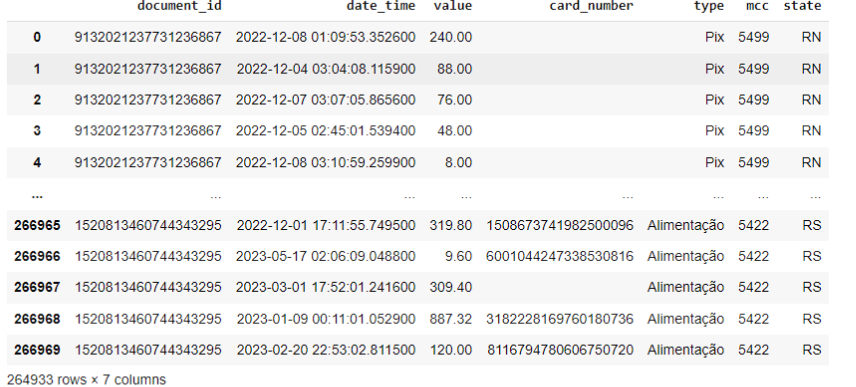
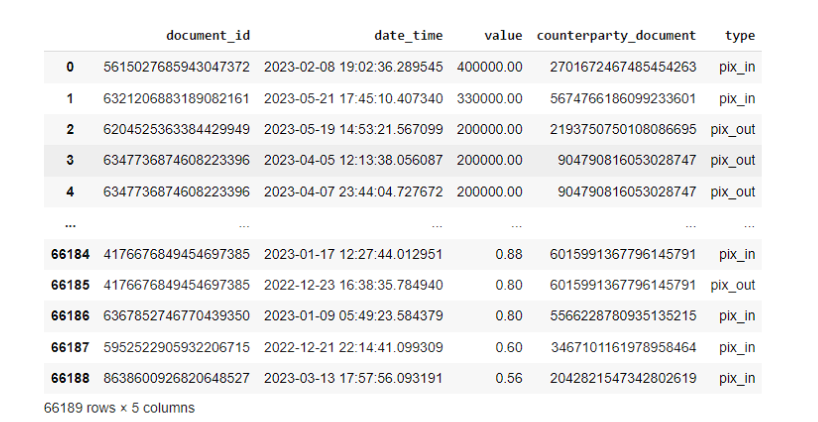

# CashHack
Este produto foi feito com o objetivo de cumprir o Desafio Brasa Hacks 2024 - Stone + IA Track. 

O CashHack é um MVP de Inteligência Artificial (IA) projetada para otimizar as operações de estabelecimentos comerciais ao personalizar cupons de cashback com base em uma análise detalhada de dados.
Para uma análise mais detalhada do produto, acesse o [relatório](https://github.com/AAugustoBS/cash-hack/blob/d5961f6da44144afa720ec7519ba909c1df82d0c/BrasaHacks-Relatorio%20de%20Produto.pdf)

## Dataset
Para o treinamento do modelo de IA criado, utilizamos os dados anonimizados e representativos de clientes Stone, fornecimentos durante o desafio. 

### Dados de Vendas
Informações detalhadas sobre cada venda recebida na maquininha, como data, hora, valor, ID do estabelecimento comercial e ID do cartão utilizado. Além disso, informações de tipo de negócio e estado do estabelecimento.

  

  <b><i> Backlog of the Beggining of Sprint 2</i></b>

### Transferências Bancárias
Registros de transferências de entrada e saída bancária, com data-hora, valor, IDs de origem e destino, e associação ao seu estabelecimento comercial.

  

  <b><i> Backlog of the Beggining of Sprint 2</i></b>

### Dicionário de MCC
Tipo de estabelecimento comercial.

  

  <b><i> Backlog of the Beggining of Sprint 2</i></b>

## Exemplos de Análise

## Apresentação do Projeto

## Membros 

- [Amanda Tartarotti](https://github.com/AmandaTartarotti)
- [Augusto Sousa](https://github.com/AAugustoBS)
- Luísa Flores
- [Leonardo Garcia](https://github.com/leonardorsg)
- [Maria Eduarda Rabelo](https://github.com/mariaarabelo)
