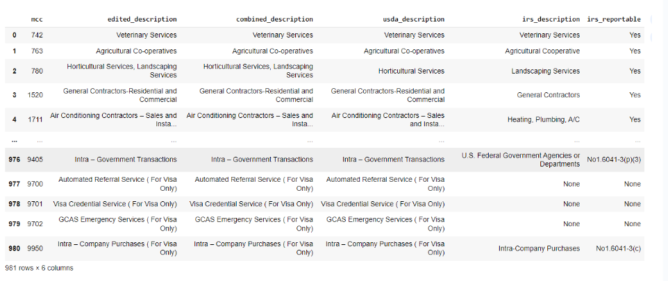

# CashHack
Este produto foi feito com o objetivo de cumprir o Desafio Brasa Hacks 2024 - Stone + IA Track. 

O CashHack é um MVP de Inteligência Artificial (IA) projetada para otimizar as operações de estabelecimentos comerciais ao personalizar cupons de cashback com base em uma análise detalhada de dados.
Para uma análise mais detalhada do produto, [clique aqui](https://github.com/AAugustoBS/cash-hack/blob/d5961f6da44144afa720ec7519ba909c1df82d0c/BrasaHacks-Relatorio%20de%20Produto.pdf)

## Dataset
Para o treinamento do modelo de IA criado, utilizamos os dados anonimizados e representativos de clientes Stone, fornecimentos durante o desafio. 

### Notebooks
Nos scripts criados e disponíveis no diretório /dataset, estão criados os modelos para previsão da próxima compra de um cliente e o modelo para detecção do melhor horário para cashback. É importante frisar que apenas os dados da tabela sales foram utilizados. Além disso, assumimos que o number_card nessa mesma tabela é o identificador de um cliente (no mundo real, teríamos acesso ao CPF, conforme a sugestão dada pelo mentor da Stone).
### Dados de Vendas
Informações detalhadas sobre cada venda recebida na maquininha, como data, hora, valor, ID do estabelecimento comercial e ID do cartão utilizado. Além disso, informações de tipo de negócio e estado do estabelecimento.

  

### Transferências Bancárias
Registros de transferências de entrada e saída bancária, com data-hora, valor, IDs de origem e destino, e associação ao seu estabelecimento comercial.

  

### Dicionário de MCC
Tipo de estabelecimento comercial.

  

## Exemplos de Análise
O objetivo da ferramenta é observar o comportamento de vendas do estabelecimento e traçar estratégias para garantir a fidelização dos clientes. 

### Identificação de Picos e Baixas

A ferramenta distribui ofertas de cashback aumentadas, oferecendo uma porcentagem maior de retorno para os clientes que visitam o estabelecimento em períodos de menor movimento. Essa estratégia busca equilibrar o fluxo de clientes, garantindo um volume de vendas mais constante ao longo do tempo.

  

### Análise do Perfil de Consumo do Cliente

A IA monitora os padrões de consumo e oferece cashbacks em momentos estratégicos, principalmente quando identifica uma queda no interesse ou na frequência das visitas. Isso incentiva os clientes a retornarem ao estabelecimento com a mesma regularidade anterior.

  

## Membros 

- [Amanda Tartarotti](https://github.com/AmandaTartarotti)
- [Augusto Sousa](https://github.com/AAugustoBS)
- Luísa Flores
- [Leonardo Garcia](https://github.com/leonardorsg)
- [Maria Eduarda Rabelo](https://github.com/mariaarabelo)
